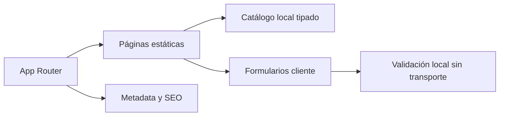

# Meviel Servicios Inmobiliarios — demo web

Sitio inmobiliario de portfolio con catálogo estático, páginas de detalle generadas por ruta, contenidos institucionales y formularios demostrativos. El foco está en arquitectura frontend, composición de páginas, responsive design y SEO técnico con Next.js.

> **Alcance:** propiedades, métricas y testimonios son contenido ilustrativo. Los formularios validan en el navegador pero no envían ni guardan información. No existe backend, CRM ni agenda real.

## Funcionalidades

- portada y páginas institucionales;
- catálogo de propiedades con rutas de detalle;
- secciones de venta, alquiler, tasación, servicios y preguntas frecuentes;
- componentes de contacto y solicitud de visita;
- metadatos Open Graph y estructura semántica;
- generación estática de páginas y rutas de detalle con `generateStaticParams`.

## Stack y arquitectura

- Next.js 16 con App Router
- React 19 y TypeScript
- Tailwind CSS 3
- fuentes optimizadas con `next/font`
- Lucide React



## Ejecutar localmente

Requiere Node.js `>=20.9 <23`.

```bash
npm ci
npm run dev
```

Verificación:

```bash
npm run lint
npm run build
npm audit
```

No se requieren variables de entorno.

## Decisiones de producto y seguridad

- un aviso visible diferencia la demo de una inmobiliaria operativa;
- los estados de éxito indican que no hubo envío;
- no se incluyen endpoints, claves ni formularios conectados;
- el build vuelve a validar TypeScript;
- dependencias principales actualizadas a Next.js 16 y React 19;
- `.gitignore` cubre secretos, builds, cachés y archivos locales.

## Limitaciones

- catálogo y datos de contacto no son una oferta comercial;
- las imágenes son recursos remotos;
- no hay búsqueda de servidor, autenticación, persistencia ni integraciones;
- no existe suite de tests automatizados.

## Estado de demo

El deployment configurado anteriormente no responde; no se enlaza para evitar una mala experiencia. Usar la ejecución local.

## Autor

Desarrollado por [Nicolás De Felippe](https://github.com/nicodf91) como proyecto de portfolio.
